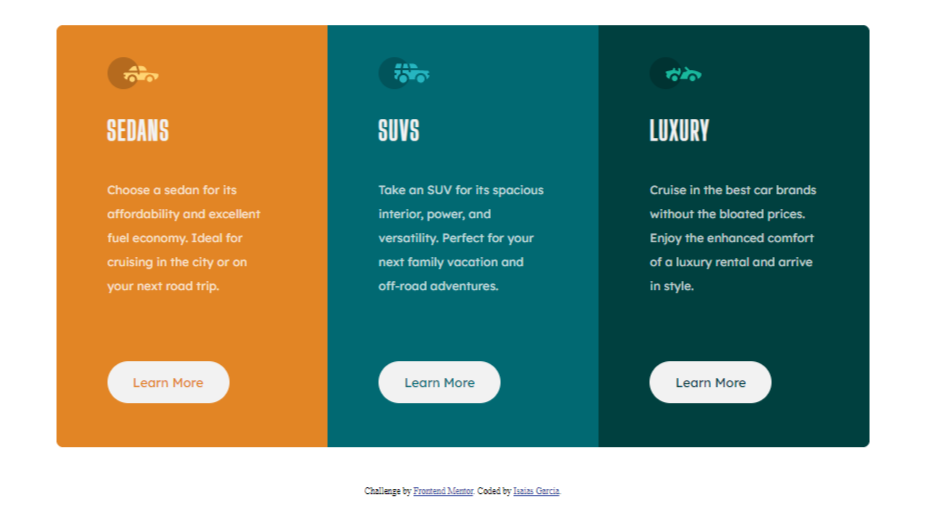
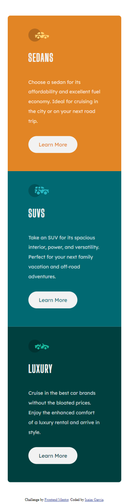

# Frontend Mentor - 3-column preview card component solution

This is a solution to the [3-column preview card component challenge on Frontend Mentor](https://www.frontendmentor.io/challenges/3column-preview-card-component-pH92eAR2-). Frontend Mentor challenges help you improve your coding skills by building realistic projects. 

### The challenge

Users should be able to:

- View the optimal layout depending on their device's screen size
- See hover states for interactive elements
### Link Github Pages
Here is the link for a live example of this proyect
https://isaico.github.io/frontedmentor-proyect-3-colum-card-/

### Screenshot

### Built with

- Semantic HTML5 markup
- CSS custom properties
- Flexbox
- Mobile-first workflow

**Note: These are just examples. Delete this note and replace the list above with your own choices**

### What I learned / Continued development
  I didn't learn a concrete thing, just reinforce some knowledge and practice some of my skills, i want to keep practicing and creating useful projects for my portfolio and my career as web developer...

### Useful resources

- [Example resource 1](https://lenguajecss.com/css/) - This helped me for some css lines that i didn't remember exactly.
- [Example resource 2](https://www.mclibre.org/consultar/amaya/css/css-fuentes-web.html) - This is an amazing article which helped me finally understand fonts in css. I'd recommend it to anyone still learning this concept.(note: the links are in spanish, because I SPEAK NATIVE SPANISH)

## Author

- Website - [Add your name here](https://www.your-site.com)//still working on this
- Frontend Mentor - [@yourusername](https://www.frontendmentor.io/profile/yourusername)
- Instagram - [@issa.garcia.lml](https://www.instagram.com/issa.garcia.lml)

